# 智能电商客服 RAG 系统（PySide6 + 本地数据存储）

一个桌面端的智能电商客服系统，包含「客户问答窗口」与「管理后台」，支持知识库 / 商品 / 用户管理，并提供基于向量检索的 RAG 能力（FAISS 可选）。

适合的使用场景：

- 想快速搭建一个电商场景的智能客服 Demo / PoC
- 希望本地保存数据（JSON 文件），避免依赖外部数据库
- 想学习一个完整的「PySide6 桌面应用 + RAG 检索 + 权限系统」示例

---

## 功能概览

- 客户问答独立窗口（面向终端用户）
  - 问答对话 / 历史记录
  - 基于知识库与商品信息的 RAG 检索
  - 侧边栏入口，可一键打开管理后台（需登录）
- 管理后台（面向运营 / 管理员）
  - AI 工作台：集中查看/调试对话情况
  - 知识库管理：增删改查知识条目，重建向量索引
  - 商品管理：维护商品信息，并自动同步为知识条目
  - 人工客服界面：人工接管部分会话
  - 日志管理：查看应用运行日志
  - 性能监控：查看 Embedding / RAG 等关键流程耗时统计
  - 统计报表：用户 / 会话 / 命中率等统计指标
  - 用户管理：账号管理、角色权限控制
- 本地 JSON 数据存储
  - `data/knowledge_base.json`：结构化知识条目
  - `data/products.json`：商品信息
  - `data/users.json`：用户账号与密码哈希
  - `data/session_status.json`：会话状态降级存储
  - `data/pending_registrations.json`：注册申请
- 向量索引检索
  - 默认使用 `faiss-cpu` 构建向量索引
  - 未安装 FAISS 时自动降级为 numpy 检索（线性扫描）
  - 支持多种索引类型：Flat / IVF / HNSW（按数据量和配置自动选择）
- API Key 存储与加密
  - 优先使用 `cryptography`（Fernet + PBKDF2）在本机加密保存
  - Windows 平台上可降级到 DPAPI
  - 再不行则只使用环境变量，不落盘

---

## 快速开始

### 1. 环境准备

- Python：建议 3.10+（最低按脚本提示为 3.8+）
- 操作系统：Windows / Linux / macOS

建议先创建虚拟环境（可选）：

```bash
python -m venv .venv

# Windows
.venv\Scripts\activate

# Linux / macOS
source .venv/bin/activate
```

### 2. 安装依赖

依赖列表见 `requirements.txt`：

```text
PySide6>=6.5.0
PySide6-Fluent-Widgets>=1.4.0
requests>=2.28.0
faiss-cpu>=1.7.0
numpy>=1.21.0
cryptography>=41.0.0
```

#### 方式 A：直接安装

```bash
pip install -r requirements.txt
```

#### 方式 B：使用安装脚本

- Windows：双击 `install.bat` 或在命令行运行
- Linux/macOS：

```bash
bash install.sh
```

> `migrate_to_v2.1.py` / `test_critical_fixes.py` 等脚本均为可选，如果不存在，安装脚本会自动跳过。

### 3. 启动应用

#### 客户问答窗口

```bash
python main.py
```

#### 管理后台

```bash
python run_admin.py
```

首次运行若不存在 `data/users.json`，系统会自动创建默认管理员账号：

- 用户名：`admin`
- 密码：`admin123`

登录后请尽快修改密码。

---

## 项目结构说明

顶层目录结构（仅列出核心部分）：

```text
.
├── core/                 # 核心逻辑层
│   ├── config.py         # 配置管理（含加密、热更新）
│   ├── api_client.py     # API 客户端（多 LLM 提供商支持）
│   ├── llm_providers.py  # LLM 提供商抽象层
│   ├── logger.py         # 日志配置与轮转
│   ├── shared_data.py    # 知识库、商品等共享数据管理
│   ├── vector_store.py   # 向量索引管理（FAISS / numpy）
│   ├── embedding.py      # 调用外部 Embedding API
│   ├── conversation.py   # 会话与消息管理
│   ├── backup.py         # 数据备份与恢复
│   ├── permissions.py    # 权限与角色控制
│   ├── statistics.py     # 统计与报表
│   ├── search.py         # 关键词搜索 + RAG 检索入口
│   ├── config_watcher.py # 配置文件热更新
│   ├── file_lock.py      # 文件锁（防止并发写冲突）
│   └── ...               # 其它工具模块
│
├── ui/                   # 前端界面层（PySide6 + Fluent Widgets）
│   ├── chat_window.py        # 客户问答主窗口
│   ├── chat_interface.py     # 聊天区域与侧边栏
│   ├── main_window.py        # 管理后台主窗口
│   ├── login_dialog.py       # 登录对话框
│   ├── workbench_interface.py# AI 工作台
│   ├── knowledge_interface.py# 知识库管理界面
│   ├── product_interface.py  # 商品管理界面
│   ├── user_interface.py     # 用户管理界面
│   ├── log_interface.py      # 日志查看界面
│   ├── performance_interface.py # 性能监控界面
│   ├── statistics_interface.py  # 数据统计界面
│   └── ...                   # 其它页面
│
├── resources/            # 静态资源
│   ├── app_icon.png      # 应用图标
│   └── styles.qss        # QSS 样式
│
├── data/                 # 运行时数据（默认忽略，不提交到 Git）
├── logs/                 # 运行时日志（默认忽略）
├── main.py               # 客户问答窗口入口
├── run_admin.py          # 管理后台入口（含登录）
├── requirements.txt
├── install.bat           # Windows 安装脚本
└── install.sh            # Linux/macOS 安装脚本
```

---

## 配置与环境变量

配置管理由 `core/config.py` 提供 `Config` 单例完成，主要特性：

- 首次运行自动创建 `data/settings.json`
- 对 `api_key` 字段做透明加解密
- 支持从环境变量覆盖配置（环境变量优先级最高）
- 支持配置文件热更新（不重启应用即可生效）

### 1. `settings.json` 配置项

文件路径：`data/settings.json`，核心字段示例：

```json
{
  "font_size": 10,
  "theme": "light",
  "llm_provider": "siliconflow",
  "api_base_url": "",
  "api_key_encrypted": "",
  "model_name": "Qwen/Qwen3-8B",
  "max_tokens": 2048,
  "temperature": 0.7,
  "api_timeout": 30,

  "embedding_model": "bge-large-zh",
  "chunk_size": 500,
  "chunk_overlap": 50,
  "retrieval_top_k": 5,
  "similarity_threshold": 0.4,

  "history_max_messages": 12,
  "history_max_chars": 6000,
  "context_max_chars": 4000
}
```

关键参数说明：

- `llm_provider`：LLM 服务商（openai / siliconflow / qwen / zhipu / deepseek）
- `api_base_url`：Embedding / 对话 API 的 Base URL（留空使用提供商默认地址）
- `api_key_encrypted`：加密后的 API 密钥（不要直接手改）
- `model_name`：使用的模型名称（支持自定义）
- `api_timeout`：API 请求超时时间（秒）
- `embedding_model`：Embedding 模型名称（例如 `bge-large-zh`）
- `chunk_size`：知识文本分块大小（字符数）
- `chunk_overlap`：相邻分块重叠长度
- `retrieval_top_k`：每次检索返回的向量最近邻数量
- `similarity_threshold`：相似度阈值（过滤低相关结果）
- `history_max_messages`：带入模型的历史消息数量上限
- `history_max_chars` / `context_max_chars`：控制上下文长度，避免超出模型最大 Token

> `api_key` 不会以明文存入 `settings.json`，而是加密后保存为 `api_key_encrypted`。

### 2. 环境变量（优先级高于配置文件）

为了避免密钥写入硬盘，建议在服务器 / 开发机上直接设置环境变量：

- `RAGPROJECT_API_KEY`（或 `SILICONFLOW_API_KEY` / `OPENAI_API_KEY`）
- `RAGPROJECT_API_BASE_URL`（或 `SILICONFLOW_API_BASE_URL` / `OPENAI_BASE_URL`）

环境变量存在时，`Config().get("api_key")` / `get("api_base_url")` 会优先读取环境变量。

Windows PowerShell 设置示例：

```powershell
$env:RAGPROJECT_API_KEY = "sk-xxxxxxxx"
$env:RAGPROJECT_API_BASE_URL = "https://api.siliconflow.cn/v1"
python main.py
```

Linux / macOS：

```bash
export RAGPROJECT_API_KEY="sk-xxxxxxxx"
export RAGPROJECT_API_BASE_URL="https://api.siliconflow.cn/v1"
python main.py
```

### 3. API 密钥加密策略概览

- 优先使用 `cryptography` 中的 Fernet，对机器特征（主机名、架构等）做 PBKDF2 派生密钥
- 在 Windows 上可退化为 DPAPI（由系统负责加密解密）
- 若两者都不可用，则不将密钥落盘，而仅存储在环境变量中

---

## RAG 工作流程简介

系统的问答流程大致如下：

1. 用户在前端输入问题（`ui/chat_interface.py`）
2. 由 `core/shared_data.KnowledgeStore` / `ProductStore` 负责加载知识和商品数据
3. 文本通过 `core/embedding.EmbeddingClient` 调用外部 Embedding API 生成向量
4. `core/vector_store.VectorStore` 使用 FAISS / numpy 搜索最相似的若干向量
5. 将检索到的知识片段与用户当前问题、历史对话拼接成上下文
6. 调用上游大模型（按你在配置中选择的 API），生成最终回复
7. 结果在 UI 中展示，并同步更新会话历史 / 统计信息

向量索引支持三种模式（内部自动选择）：

- Flat：小数据量，精确搜索
- IVF：中等数据量，需要一次训练
- HNSW：大规模数据，图索引，高召回率

向量索引文件：

- `data/vectors.index`：FAISS 索引
- `data/vectors_map.json`：向量 ID 与知识条目 ID 的映射

如果删除这两个文件，系统在需要时会重新构建索引（耗时与知识库大小相关）。

---

## 数据文件说明（运行时生成）

默认数据目录：`data/`（已加入 `.gitignore`）。

核心文件：

- `knowledge_base.json`
  - 存储知识条目列表（包括问题、答案、关键词、分类等）
  - 文件缺失时，会写入一批默认示例知识
- `products.json`
  - 存储商品信息，每个商品可自动生成若干知识条目
- `users.json`
  - 存储用户账号信息，密码使用 PBKDF2 哈希
  - 文件缺失时，会自动创建默认管理员账号 `admin/admin123`
- `session_status.json`
  - 会话状态降级存储（异常情况下可恢复会话）
- `pending_registrations.json`
  - 存储待审核的注册信息
- `vectors.index` / `vectors_map.json`
  - 向量索引与映射

> 建议只在开发 / Demo 环境下提交部分脱敏数据样例；生产环境请确保这些文件不进入 Git 仓库。

---

## 权限与用户角色

权限管理位于 `core/permissions.py`：

- 内置两类角色：
  - `admin`：管理员，拥有全部菜单和操作权限
  - `cs`：客服，仅能访问与客服工作相关的页面
- 不同角色看到的菜单项不同，例如：
  - `admin` 能看到知识库管理、商品管理、日志、性能、统计等
  - `cs` 只看到工作台、人工客服等

用户数据保存在 `data/users.json` 中，密码采用 PBKDF2-SHA256 进行哈希存储（实现见 `ui/login_dialog.py` 内的 `AuthManager`）。

---

## 日志与排错

日志由 `core/logger.py` 初始化，特点：

- 使用 `RotatingFileHandler` 进行日志轮转
- 控制台 + 文件双通道输出
- 日志目录：`logs/`（已加入 `.gitignore`）

常见排错步骤：

1. 运行应用时终端报错
2. 打开 `logs/app.log` / `logs/error.log`
3. 根据模块名（例如 `core.embedding`、`core.vector_store`）定位问题

如需调高日志级别，可在启动前设置环境变量或直接在代码里调用 `LogManager().set_level("DEBUG")`。

---

## 开发与调试建议

### 1. 语法/类型检查

目前仓库未集成专用测试框架，最基础的校验可以使用：

```bash
python -m compileall -q .
```

你也可以按需引入：

- `pytest`：编写单元测试 / 集成测试
- `ruff` 或 `flake8`：做代码风格与静态检查

### 2. 调试建议

- 推荐使用虚拟环境和 IDE（VS Code / PyCharm）
- 调试 UI 时，可直接在对应界面文件底部添加临时启动代码，或从 `main.py` / `run_admin.py` 入口打断点

---

## GitHub 提交与开源建议

### 1. 不要提交运行时产物

仓库已通过 `.gitignore` 忽略：

- 虚拟环境目录（`.venv/`、`venv/` 等）
- `logs/`（日志）
- `data/`（运行时数据、索引、锁文件等）
- `data_backup_*`（备份目录）
- Python 缓存文件（`__pycache__/`、`*.pyc`、`*.pyo`）

首次提交前建议检查：

```bash
git status
```

### 2. 已误提交 data/logs 怎么办？

如果已经把 `data/` 或 `logs/` 提交进 Git 历史，可以先停止追踪：

```bash
git rm -r --cached data logs
git commit -m "chore: stop tracking runtime data"
```

> 如果你担心敏感信息已经进入历史记录，需要进一步使用 `git filter-repo` 等工具做历史清理。

### 3. 自动敏感信息自检（可选）

在本地使用简单命令检查代码中是否包含疑似密钥（不包含 `data/` 和 `logs/`）：

```bash
git grep -n \"API_KEY\\|OPENAI\\|SILICONFLOW\\|sk-\\|Bearer \" -- . \
  -- ':!data' ':!logs'
```

---

## 常见问题 FAQ

### Q1：没有安装 `faiss-cpu` 能运行吗？

可以。系统会自动降级到 numpy 检索，但检索速度和性能会受影响，建议生产环境安装 `faiss-cpu`。

### Q2：删除 `vectors.index` / `vectors_map.json` 会怎样？

- 下次需要检索时会自动重建向量索引
- 重建耗时与知识库规模相关
- 对已有数据不会造成破坏（只是重新索引）

### Q3：忘记管理员密码怎么办？

你可以删除 `data/users.json` 文件，然后重新启动应用。系统会重新创建默认管理员账号 `admin/admin123`。  
注意：这样会清空现有用户信息，请谨慎操作。

### Q4：如何切换 API 提供方（比如从 SiliconFlow 换到 OpenAI）？

系统内置了多 LLM 提供商支持，可以在设置界面直接切换：

1. 打开管理后台 → 设置
2. 在「服务商」下拉框中选择目标提供商
3. 填写对应的 API 密钥
4. 可选：自定义 API 地址和模型名称
5. 点击「测试连接」验证配置
6. 保存设置

目前支持的 LLM 提供商：

| 提供商 | 默认 API 地址 | 默认模型 |
|--------|---------------|----------|
| OpenAI | https://api.openai.com/v1 | gpt-3.5-turbo |
| 硅基流动 | https://api.siliconflow.cn/v1 | Qwen/Qwen3-8B |
| 通义千问 | https://dashscope.aliyuncs.com/compatible-mode/v1 | qwen-turbo |
| 智谱AI | https://open.bigmodel.cn/api/paas/v4 | glm-4-flash |
| DeepSeek | https://api.deepseek.com/v1 | deepseek-chat |

你也可以通过环境变量覆盖配置：
- `RAGPROJECT_API_KEY` / `SILICONFLOW_API_KEY` / `OPENAI_API_KEY`
- `RAGPROJECT_API_BASE_URL` / `SILICONFLOW_API_BASE_URL` / `OPENAI_BASE_URL`

---

如需进一步将本项目打包为可安装的 Python 包（例如 `pip install` 后通过 `python -m xxx` 启动），可以在此基础上：

- 引入 `pyproject.toml` / `setup.cfg` 进行打包配置
- 将 `main.py` / `run_admin.py` 封装为 console_scripts 入口
- 将运行时数据目录迁移为用户级目录（例如 `~/.rag-app/`）

---

## 实机演示（界面截图）

> 以下截图位于仓库的 `image/` 目录中，GitHub 上可直接预览。

### 登录界面

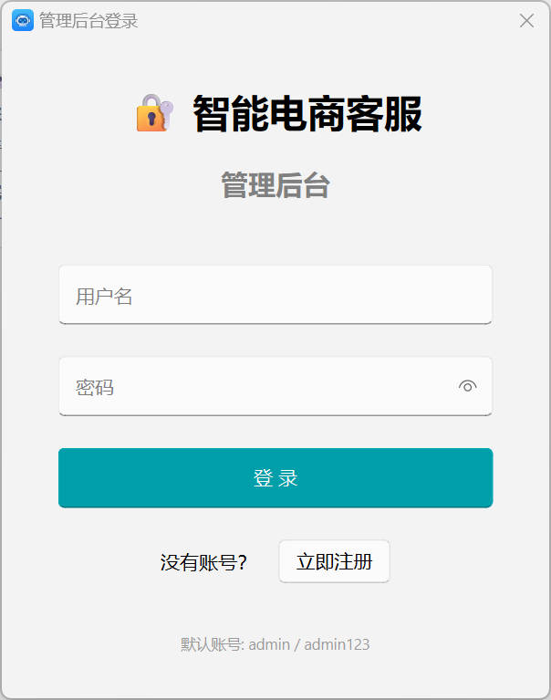

用于管理员 / 客服身份验证的登录窗口，支持账号密码登录与错误提示。

### 注册界面


新用户注册页面，提交后进入待审核列表，由管理员在后台审批。

### 客户问答窗口（普通视图）

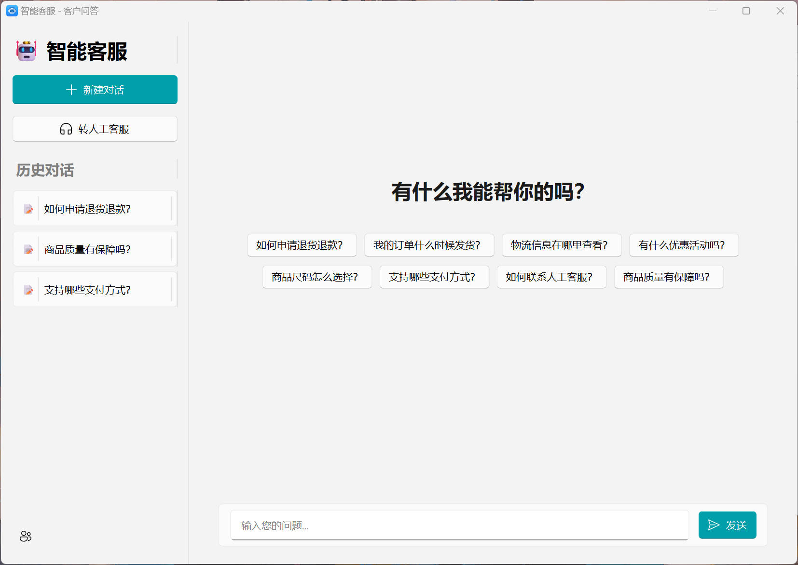

面向终端用户的独立问答窗口，支持连续对话和历史记录展示。

### 客户问答窗口（侧边栏展开）

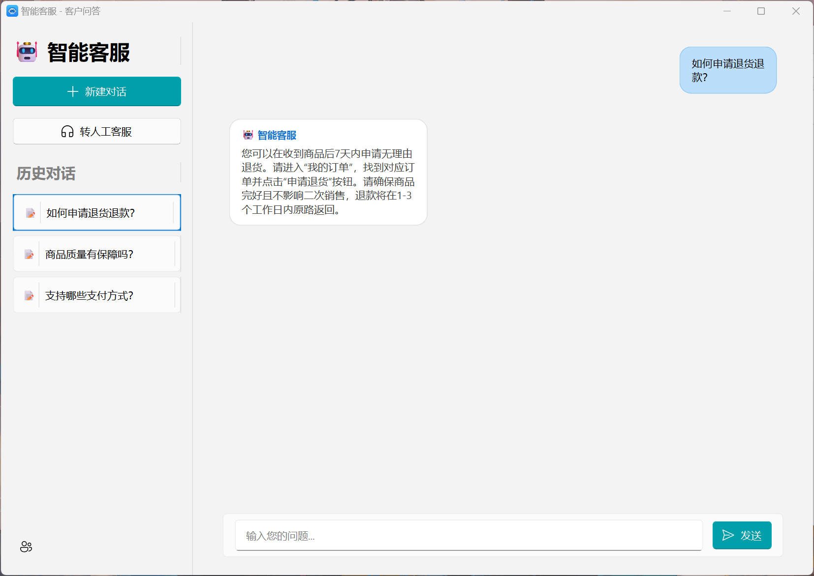

展示左侧快捷入口（如打开管理后台、查看相关信息等）的界面布局。

### AI 工作台

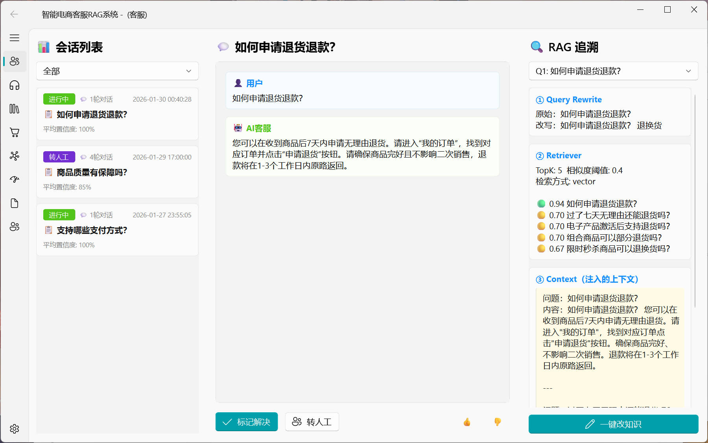

用于客服 / 管理员集中查看与调试 AI 对话的工作台视图。

### 知识库管理

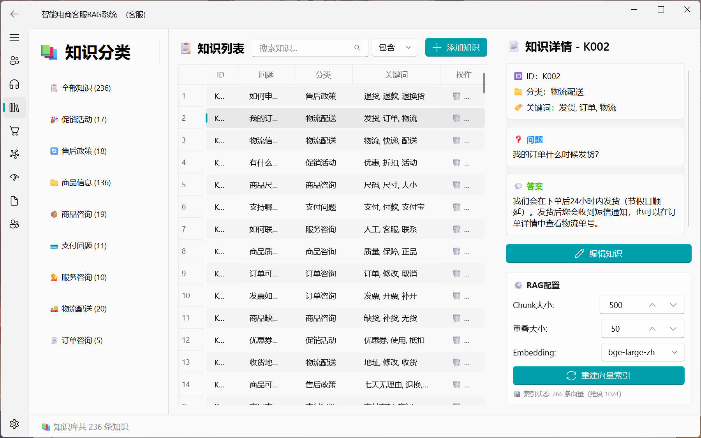

支持知识条目增删改查、搜索、批量操作以及重建向量索引。

### 商品管理

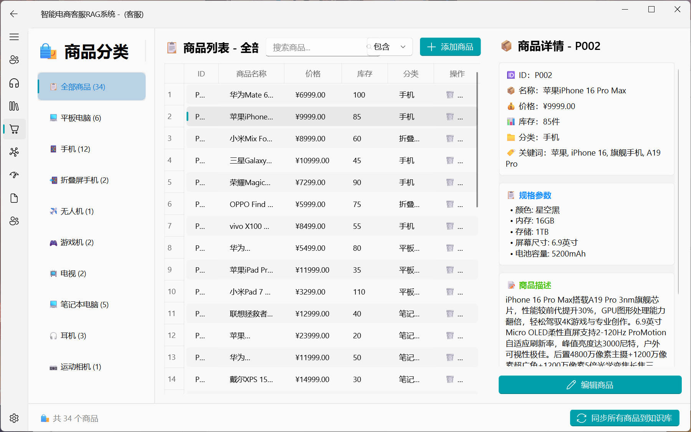

用于维护电商商品信息，支持商品信息与知识库的联动同步。

### 人工客服界面

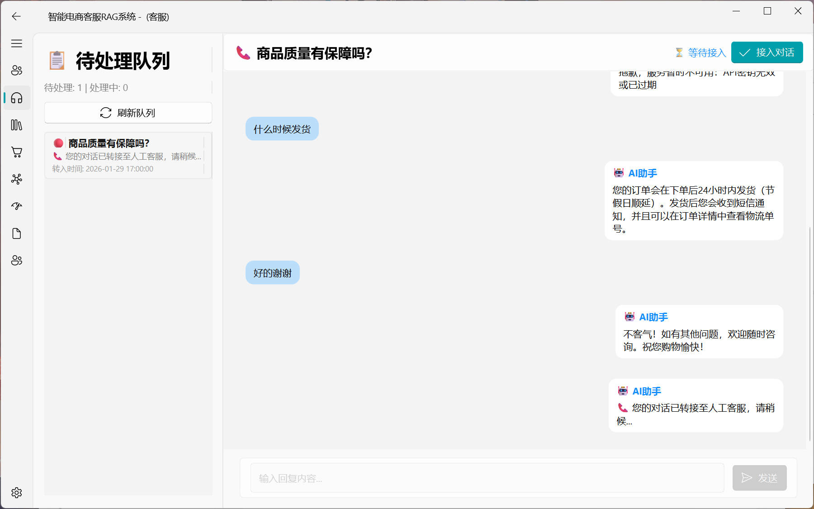

人工客服接管界面，可查看待处理会话并进行人工回复。

### 用户管理

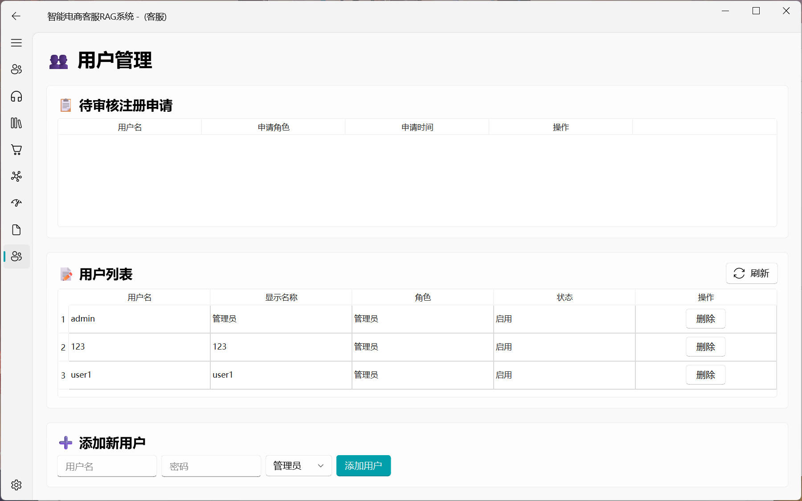

管理员用于管理系统用户、分配角色权限（管理员 / 客服等）的界面。

### 性能监控

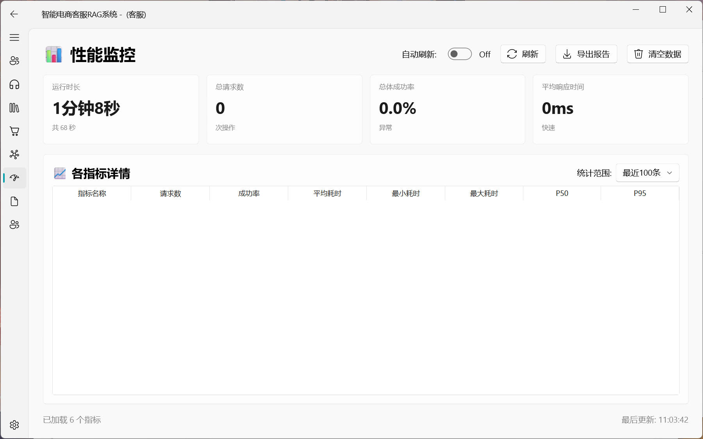

展示 Embedding、检索、接口调用等关键环节的性能指标与耗时统计。

### 数据统计

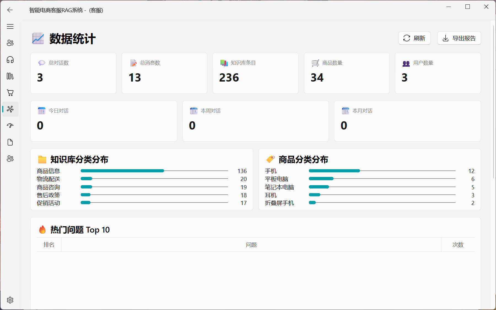

对会话数量、命中率、用户活跃度等进行图表展示的统计页。

### 日志管理

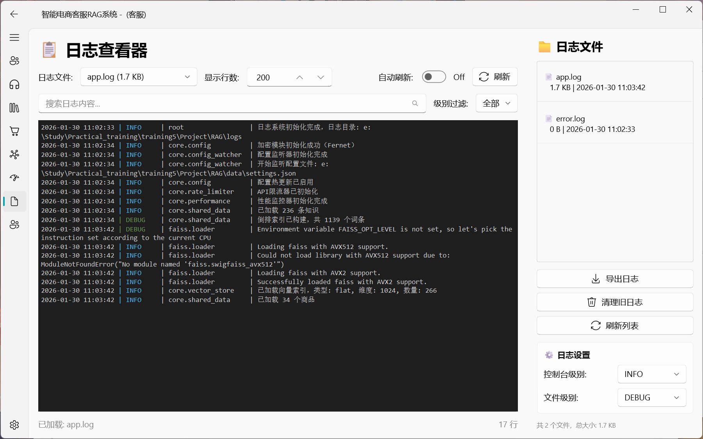

提供运行日志查看与筛选功能，便于排查异常与审计操作记录。
